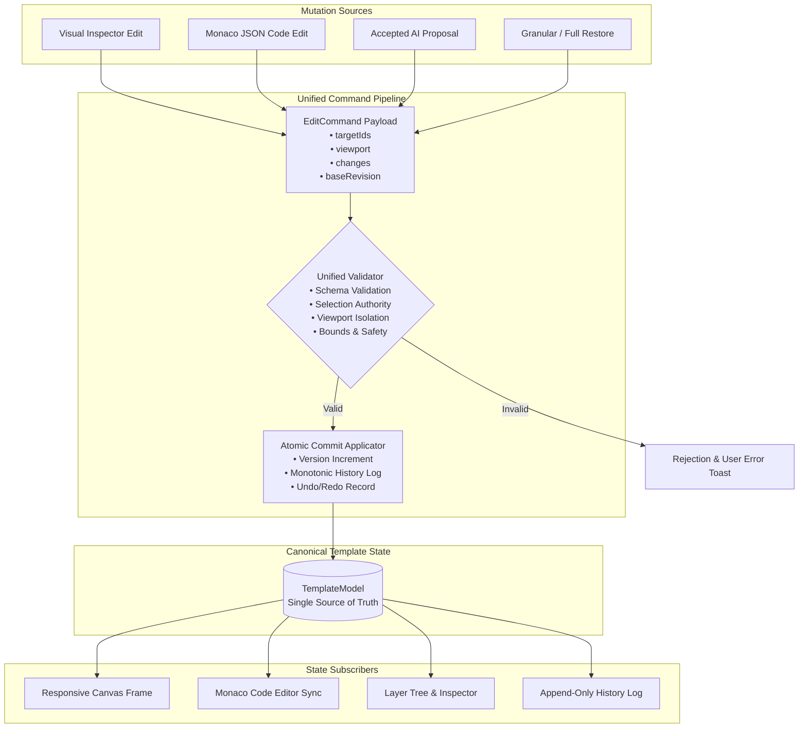
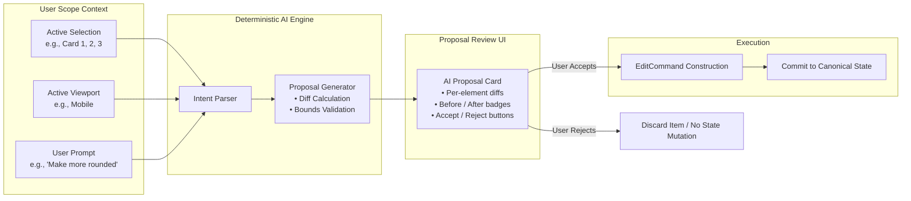

# System Architecture & Technical Specifications

The **Scoped AI Template Editor** implements a deterministic, state-authoritative architecture designed to provide safe visual editing, reviewable AI proposals, synchronized code editing, and granular revision recovery.

---

## 1. High-Level System Architecture

All mutations to application state originate from one of four input vectors and pass through a single validation and commit funnel:



---

## 2. The Scoped AI Lifecycle

AI in this architecture is strictly modeled as a **Proposal Generator** rather than a state mutator. The AI engine does not have write access to the Zustand template store.



### Safety Rules Enforced:
1. **Selection Lock**: If 3 elements are selected, the AI engine can produce diffs for at most those 3 elements. It is impossible for an unselected element to be modified.
2. **Viewport Containment**: Edits triggered under Tablet or Mobile viewports produce responsive overrides and never mutate desktop base values.
3. **Base Revision Locking (Optimistic Concurrency)**: If the document version advances between proposal generation and user acceptance, the proposal is flagged as `stale` and rejected to prevent race conditions.

---

## 3. Canonical Template Model

The template is defined as an immutable tree of `TemplateNode` objects governed by `src/model/types.ts`:

```typescript
export interface TemplateModel {
  id: string;
  name: string;
  version: number;          // Monotonically incrementing revision ID
  rootNodeId: string;
  nodes: Record<string, TemplateNode>;
  metadata: {
    createdAt: number;
    updatedAt: number;
  };
}

export interface TemplateNode {
  id: string;
  type: NodeType;           // 'section' | 'container' | 'card' | 'text' | 'button' | 'image'
  name: string;
  parentId: string | null;
  children: string[];
  styles: Record<string, any>;
  content?: Record<string, any>;
  responsive?: {
    tablet?: Record<string, any>;
    mobile?: Record<string, any>;
  };
}
```

### Node ID Invariance
Node IDs (e.g., `hero-heading`, `card-1`, `cta-btn`) are persistent and immutable across all operations:
- Direct edits modify styles inside the existing node.
- AI proposals match target node IDs directly.
- Undo, Redo, and Restore operations reapply or restore properties to the existing ID without generating duplicate or surrogate keys.

---

## 4. Unified Command Pipeline (`EditCommand`)

Every edit in the application is encapsulated in an `EditCommand` interface:

```typescript
export interface EditCommand {
  id?: string;
  source: 'manual' | 'code' | 'ai' | 'restore';
  targetIds: string[];
  viewport: Viewport;       // 'desktop' | 'tablet' | 'mobile'
  baseRevision: number;     // Concurrency lock
  changes: Record<string, {
    styles?: Record<string, any>;
    content?: Record<string, any>;
  }>;
  summary?: string;
}
```

### Validation Stages (`src/commands/validate.ts`):
1. **Schema Check**: Ensures all proposed property keys (e.g., `fontSize`, `borderRadius`, `backgroundColor`) exist in the whitelist and contain valid CSS-compatible values.
2. **Target Node Existence**: Verifies that all `targetIds` exist in `template.nodes`.
3. **Bounds Checking**: Enforces numerical bounds (e.g., `fontSize` between 8px and 120px, `padding` between 0px and 200px, `borderRadius` between 0px and 100px).
4. **Security Sanitization**: Blocks script injection patterns, `eval()`, `javascript:` protocols, or invalid HTML tags.

---

## 5. Bidirectional Code Synchronization

The Monaco JSON editor (`src/code/MonacoEditorWrapper.tsx`) and the Visual Canvas interact bidirectionally without feedback loops:

```
Visual Canvas Edit ──▶ Canonical State (Rev N+1) ──▶ Monaco Editor receives updated JSON
                                                                ▲
                                                                │
Monaco JSON Edit ────▶ Validate JSON & Schema ───▶ Commit ──────┘
```

- When the visual canvas or AI updates state, Monaco's internal model updates cleanly without triggering an edit event.
- When the user types in Monaco, changes are debounced and linted in real-time. Committing sends the parsed diff through `validateCommand()` before updating the canvas.

---

## 6. Granular History & Recovery Model

Every commit appends a new `Revision` record:

```typescript
export interface Revision {
  revision: number;
  timestamp: number;
  source: 'manual' | 'code' | 'ai' | 'restore';
  description: string;
  affectedIds: string[];
  changes: Record<string, {
    before: { styles?: Record<string, any>; content?: Record<string, any> };
    after: { styles?: Record<string, any>; content?: Record<string, any> };
  }>;
  snapshot?: TemplateModel;
}
```

### Granular Property Restoration:
When the user clicks `[Restore Property]` on `Hero Title > fontSize`:
1. The previous value (`fontSize: 56px`) is extracted from the target revision.
2. A new `EditCommand` is constructed with `source: 'restore'`.
3. The command commits to state, incrementing the revision counter (e.g., Revision 18 &rarr; Revision 19).
4. Unrelated properties (colors, margins, other nodes) remain untouched.
5. All historical records are preserved chronologically.
